#### Project title: Hands-on Lab: Using Git to Track and Manage Changes for a Simple Form

###Project overview

This project involves creating a simple HTML form that collects user information, including Name, Email, and Message. The primary objective is not only to build the form but also to demonstrate the effective use of Git for version control.

**Prerequisites:**

* Git installed on your machine
* A basic understanding of Git commands
* An existing Github Repository
* A simple HTML form file (form.html) and a CSS file (style.css) that collects user information, including name, email, and message in a local directory

**Objectives**
* Develop a Funtional simple HTML form
* Apply CSS styling for improved user interface
* Use Git to:
1. Track changes
2. Maintain version history
3. Manage code safely
4. Revert to previous versions when needed

**Technologies Used**

1. HTML5 – Structure of the form
2. CSS3 – Styling and layout
3. Git – Version control system
4. GitHub repository

**Features**

* User-friendly contact form
Input fields:
1. Name
2. Email
3. Message
Form validation using HTML attributes (required)
4. Responsive and clean UI design
5. Version tracking using Git

**Git Workflow Used**

1. cloning the github repository:
git clone git@github.com:ABDULAZEEZISAH/simple-form1.git

2. Add Files
   
git add .

3. Commit Changes by commit the staged files with a message:
   
git commit -m "Initial commit for simple form"

4. Push the initial commit to the remote repository:
 
 git push

5. Make and Track Changes:

Each update (e.g., phone number update, adding CSS, validation) is committed:

git add sample simple form.html style.css

git commit -m "Added phone number field and updated styles"

6. view the Git history to check all the changes you've made:

git log

7. Revert to a Previous Version:

git checkout  simple-form.html

8.  Branching for New Features:

git checkout -b feature-add-captcha

9. Make the necessary changes for the CAPTCHA feature, then stage and commit them:

git add simpl-form.html

git commit -m "Added CAPTCHA feature"

10. Merge the changes back into the main branch:

git checkout main
git merge feature-add-captcha

**Create a file called simple-form.html**

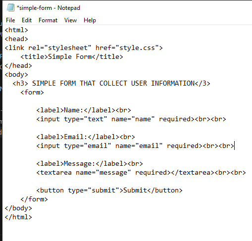

**A simple HTML form that collects user information, including name, email, and message.**

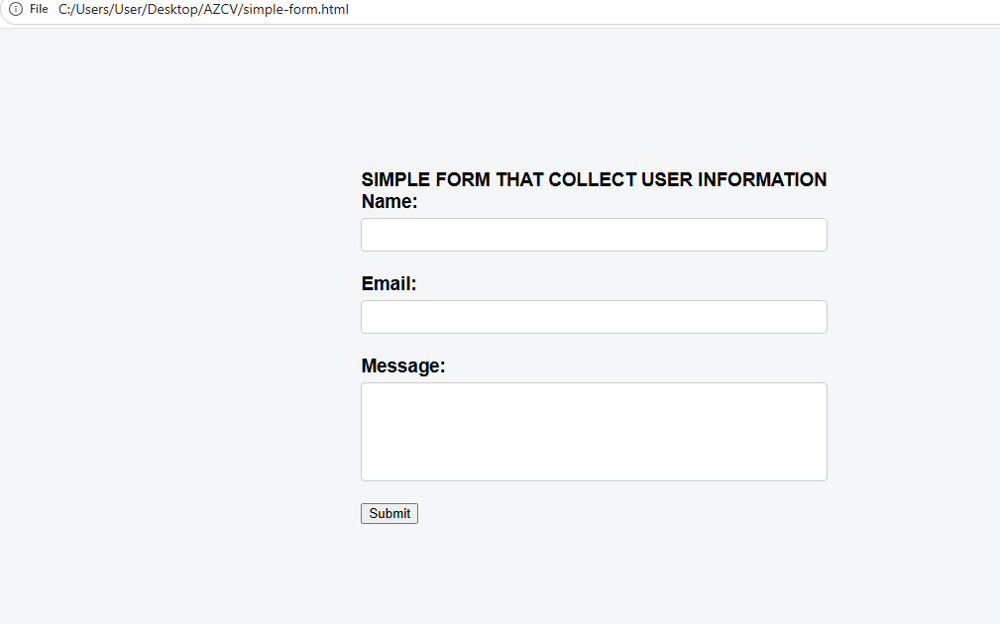

**cloning the github  repository:**

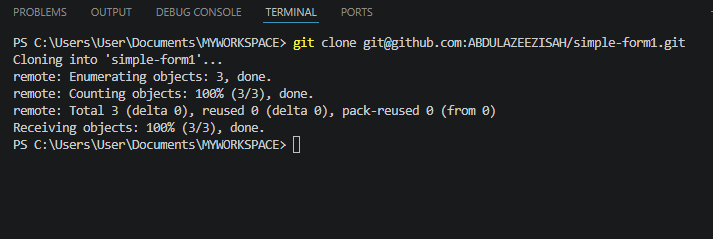

**Git Add and Commit Your First Version file to staging area**

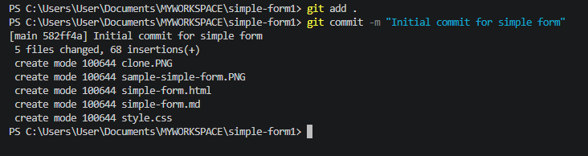

**Git push cmd**

Now Git has saved  first version (snapshot) of the project.

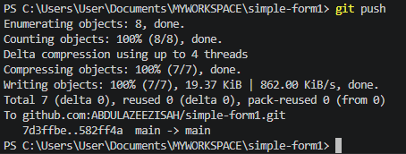

**Making change request by updating the phone number field to the form**

Updating the file simple-form.html with phone number field

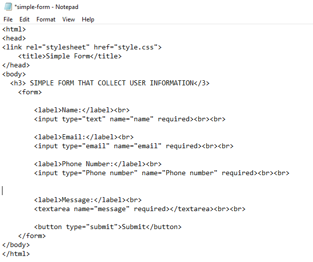

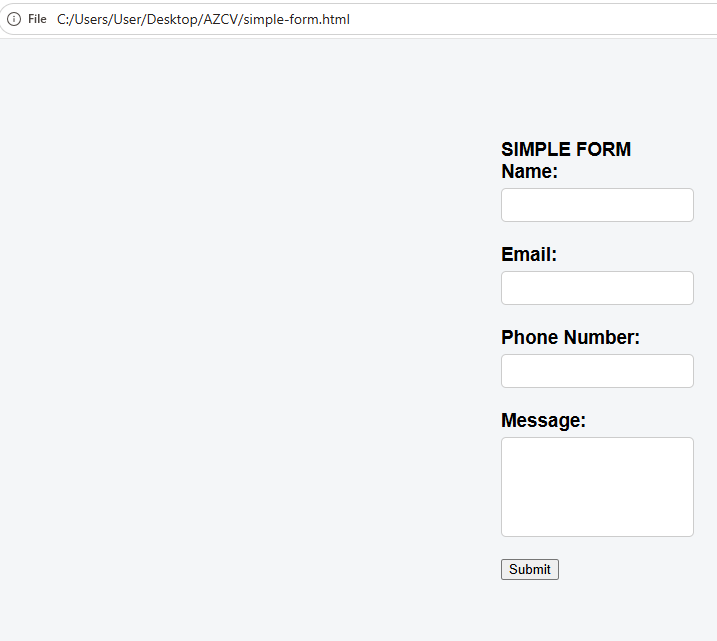

**using Git to add phone number field and push cmd**

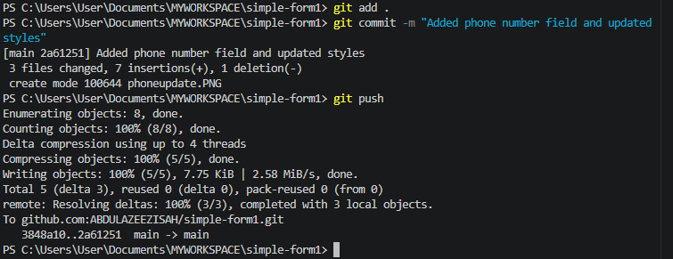

**View History of Changes (Run Gitlog cmd)**

Output

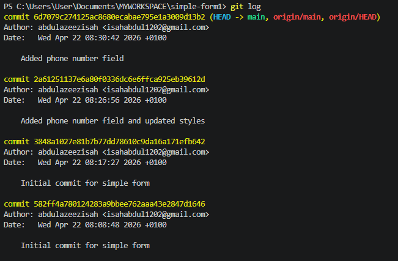

**Reverting form.html to the last working version.**

Go back to a specific version using Git checkout cmd

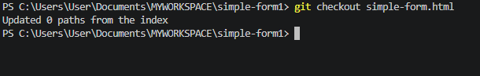

**Experiment with adding a CAPTCHA feature to the form**

Creating a new branch called feature-add-captcha and switch to it:

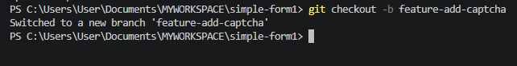

**Merging the changes back into the main branch: usig Git check and merge cmd**

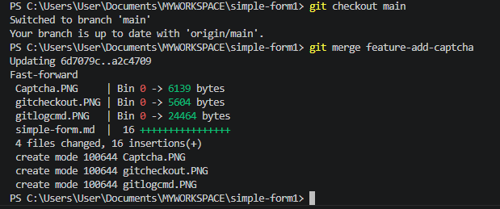